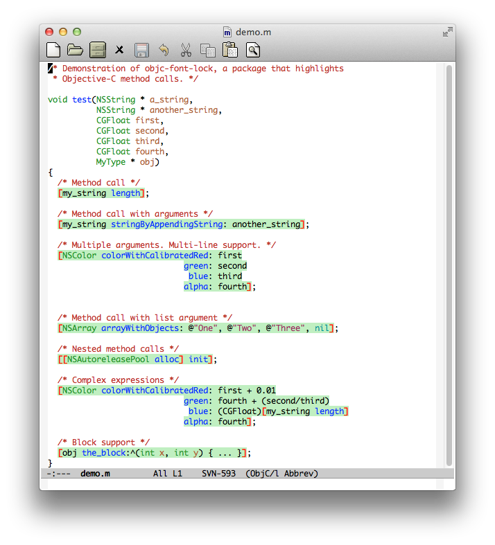

# objc-font-lock - Highlight Objective-C method calls

*Author:* Anders Lindgren 
*Version:* 0.0.0 

This package highlights Objective-C method calls.

## Background

Objective-C use a syntax for method calls it has inherited from
Smalltalk. Unfortunately, this syntax is frustratingly hard to read
-- when browsing through code, method calls tend to "disappear" as
they are different from normal C function calls.

By highlighting method calls, it is possible to read the same piece
of code faster and more accurate.

The following screenshot demonstrates the highlighting effect of
this package:

## Usage

Place the source file in a directory in the load path. Add the
following lines to an appropriate init file:

       (autoload 'objc-font-lock-setup "objc-font-lock" nil t)
       (add-hook 'objc-mode-hook 'objc-font-lock-setup)

### Custom configuration

Method calls are highlighted as follows

                            Controlling variable:           Default:
    [expr func: expr]
    ^               ^ - objc-font-lock-bracket-face       Warning face
          ^^^^        - objc-font-lock-function-name-face Function name face
    ^^^^^^^^^^^^^^^^^ - objc-font-lock-background-face    Grey 85

To change the face used, change the face variable. By setting it to
"nil", the corresponding part of the method call will not be
highlighted. For example:

    ;; Don't highlight brackets.
    (setq objc-font-lock-bracket-face nil)
    ;; Use `secondary-selection` (a builtin face) as background.
    (setq objc-font-lock-background-face 'secondary-selection)

## Under the hood

This package parse the content of brace pairs to decide if they
form an Objective-C method call, and what the parts are. It is
neither aware of the context in which the brackets appear, nor what
included symbols corresponds to. Despite these limitations, this
package highlight most typical constructs used in real-world
Objective-C.

## Implementation

An Objective-C method call is on one the following forms

    [expression func]
    [expression func: expression func: expression....]

This package use font-lock rules with a function performing the
matcher (rather than an regexp). The matcher will find a bracket
pair (skipping those that are used for plain C arrays or are
located in a string or comment). Anchored sub-rules will match and
highlight individual parts. The function names an brackets are
highlighted using one rule placed before the standard Font Lock
rules. The background is highlighted using another placed last.

To recognize an expression, the Emacs built-in expression parser,
`forward-sexp`, is used for plain trivial expressions (like
identifiers and numbers) and expressions inside parentheses. On top
of this, this package checks for complex expressions by looking for
casts and infix operators.

The pre- and postincrement and -decrement operators don't fall into
the above pattern. However, any code containing them should be
fontified exactly like they would, if they weren't there. Hence,
they are treated as "whitespace".

Without knowing if an identifier denotes a type or not, a construct
like `[(alpha)beta]` is ambiguous. It can either be interpreted as
a method call, where the object `alpha` is sent the message `beta`.
However, it can also be seen as an array subscript, where the
expression `beta` is cast to the type `alpha`. This package treats
any construct that looks like a cast as though it is a cast.

---
Converted from `objc-font-lock.el` by [*el2markup*](https://github.com/Lindydancer/el2markdown).